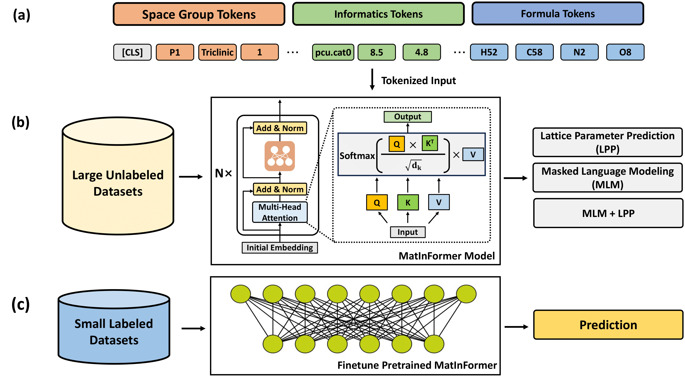

# MatInFormer: Materials Informatics Transformer
#### [[arXiv]](https://arxiv.org/abs/2308.16259) [[PDF]](https://arxiv.org/pdf/2308.16259.pdf) </br>
[Hongshuo Huang](https://github.com/hongshuh), [Rishikesh Magar](https://www.linkedin.com/in/rishikesh-magar) ,[Changwen Xu](https://changwenxu98.github.io/),  [Amir Barati Farimani](https://www.meche.engineering.cmu.edu/directory/bios/barati-farimani-amir.html) </br>
Carnegie Mellon University </br>



This is the official implementation of <strong><em>MatInFormer</em></strong>: ["Materials Informatics Transformer: A Language Model for Interpretable Materials Properties Prediction"](https://arxiv.org/abs/2308.16259). In this work, we introduce a novel approach that involves learning the grammar of crystallography through the tokenization of pertinent space group information. We further illustrate the adaptability of MatInFormer by incorporating task-specific data pertaining to Metal-Organic Frameworks (MOFs). 

## Enviroment Set up

```sh
conda env create -f environment.yml
```


## Example of SSL
```sh
cd /path/to/matinformer/
python sgt/pretrain.py
```

## Example of fintune 
For materials project benchmark, you can train and test by
```sh
python sgt/mb_train.py
```
if you want to run on your own dataset like MOFs, change the config file and run
```sh
python sgt/hoip_train.py
```


## Cite This Work
If you use this code please cite the relevant work:

`MatInFormer` - Materials Informatics Transformer: A Language Model for Interpretable Materials Properties Prediction [[arXiv]](https://arxiv.org/abs/2308.16259)
```tex
@article{huang2023materials,
  title={Materials Informatics Transformer: A Language Model for Interpretable Materials Properties Prediction},
  author={Huang, Hongshuo and Magar, Rishikesh and Xu, Changwen and Farimani, Amir Bariti},
  journal={arXiv preprint arXiv:2308.16259},
  year={2023}
}
```


`wren` - Rapid Discovery of Stable Materials by Coordinate-free Coarse Graining. [[Paper]](https://www.science.org/doi/10.1126/sciadv.abn4117) [[arXiv]](https://arxiv.org/abs/2106.11132)

```tex
@article{goodall_2022_rapid,
  title={Rapid discovery of stable materials by coordinate-free coarse graining},
  author={Goodall, Rhys EA and Parackal, Abhijith S and Faber, Felix A and Armiento, Rickard and Lee, Alpha A},
  journal={Science Advances},
  volume={8},
  number={30},
  pages={eabn4117},
  year={2022},
  publisher={American Association for the Advancement of Science}
}
```